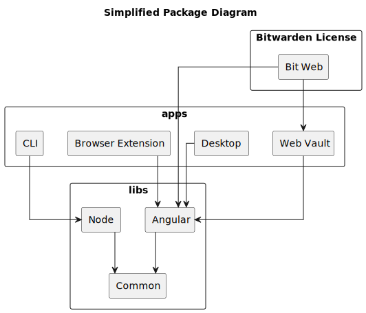

# 网络客户端架构


对应的[官方页面地址](https://contributing.bitwarden.com/architecture/clients/)


基于 Web 的客户端（以下简称为客户端）包含 _Web Vault_、_浏览器扩展_、_桌面应用程序_（基于 Electron）和 _CLI_。它们共享同一个公共代码库和同一个 [Git 存储库](https://github.com/bitwarden/clients)。

mono-repository 根目录包含三个主要文件夹：

* `apps` - 我们不同的应用程序特定代码，由 `web`、`browser`、`desktop` 和 `cli` 组成。
* `bitwarden_license` - Bitwarden 网络密码库的许可版本。
* `libs` - 不同应用程序之间共享的代码。

`libs` 包含以下项目：

* `Common` - 所有客户端（包括 CLI）之间共享的通用代码。&#x20;
* `Angular` - 所有可视客户端使用的 Angular 特定代码。
* `Components` - Angular 组件库。
* `Node` - 曾经是 CLI 和目录连接器 CLI 共享的代码，但由于目录连接器不再使用相同版本的库，因此该模块被弃用。

## 软件包图解 

下面是客户端存储库的简化的包图解。


为了便于阅读，所有应用程序都依赖的 `common` 项目被隐藏了起来。


<figure><figcaption></figcaption></figure>

