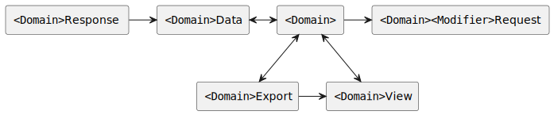

# 数据模型


对应的[官方页面地址](https://contributing.bitwarden.com/architecture/clients/data-model)


本文档描述了不同客户端应用程序使用的内部数据模型。我们使用几个专用模型来表示我们的数据层。数据转换管道略显复杂。

<figure><figcaption></figcaption></figure>

## 域 

域模型位于我们数据模型的中心，代表了已加密的数据。

## 视图 

视图模型表示相应 `Domain` 模型的解密状态。它们通常与 `Domain` 模型匹配，但包含任何 `EncString` 字段的已解密字符串。

## 数据 

`Data` 模型是相应 `Domain` 的可序列化版本。在大多数情况下，这意味着将 `Date` 转换为 `string`。它专门用于将 `Domain` 模型序列化到磁盘以持久化状态或导出。这意味着它还需要支持对旧数据模型的反序列化，传统的做法是提供良好的默认值。

## 导出 

导出模型从域或视图模型构建而来。用于导入和导出 Bitwarden 数据。

## 请求和响应（已弃用） 

正在迁移到域的 API 服务的旁边。到那时，它将不再是我们数据模型的核心部分。

## API 

用于从响应转换为数据的共享 API 模型。本质上是请求模型的可重用扩展。
