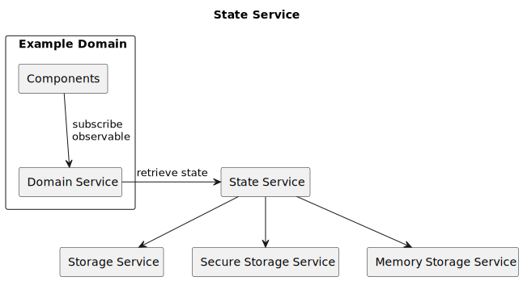

# 概述


对应的[官方页面地址](https://contributing.bitwarden.com/architecture/clients/overview)


应用程序是使用分层架构构建的。这些层分别是：

* 状态层
* 服务层
* 表示层（组件或 CLI 命令）

不同层之间相互通信时主要使用[数据模型](data-model.md)中描述的模型。

## 状态层 

应用程序的核心是状态层。这一层负责跟踪状态，状态包括当前用户、密码库项目等。状态层还负责将状态持久化到磁盘，以及从磁盘加载它。

目前，状态主要在名为 `StateService` 中实现的。它充当所有其他服务的上帝类来访问状态。这并不理想，我们正在努力寻找一个更好的解决方案。

我们还有_存储服务_，存储服务是特定于实现的服务，用于将状态持久化到不同的存储介质中。其主要由三类构成：

* 持久化存储。
* 内存中的存储。
* 安全持久化存储。

除了个别域服务外，_状态服务_本身不应该被调用，而且这些服务应该只访问自己的域。此外，只有一个服务应该访问状态服务中的特定域。

下面是一个_域组件_和_域服务_如何与_状态服务_交互的例子。

<figure><figcaption></figcaption></figure>

## 服务层 

状态层之上是服务层。这一层主要负责通过与状态层的交互和接收来自表示层的命令来执行业务逻辑。在这一层，我们还有与服务器通信的 API 服务。

服务应该主要使用可观察对象来公开数据访问，这鼓励了反应式表示层，它总是显示最新状态。随着我们继续将组件分解成更小的部分，它们保持最新并与业务逻辑服务交互也变得很重要。

## 表示层 

表示层要么使用 [Angular](../presentation/angular.md) 实现，要么使用 CLI 中的[命令模式](../presentation/cli.md)实现。这一层应该只关注表现方面，所有业务逻辑都应该像前面提到的那样放在服务中。这允许多个组件提供相同的功能，而无需继承。
