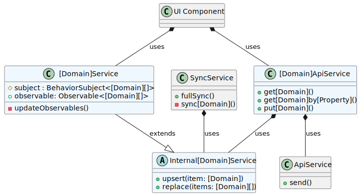
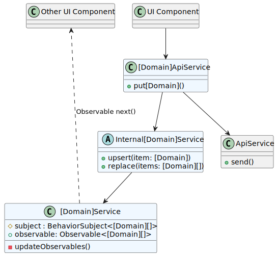
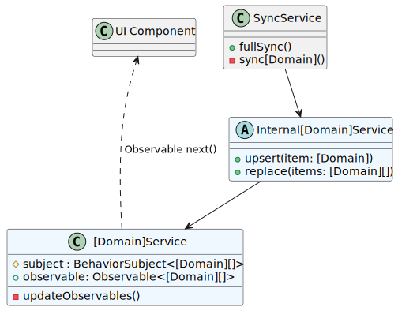
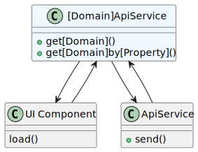

# 实现


对应的[官方页面地址](https://contributing.bitwarden.com/architecture/clients/services/implementation)


我们已经定义了 Bitwarden 客户端服务的 [Vision](vision.md)。下面的实现是我们在代码库范围内为实现这些目标所做的尝试。我们目前正在迁移我们的服务，以反映这一理想。

## 不同类型的服务 

Bitwarden 客户端的服务架构主要由三种不同类型的服务组成，适用于我们[数据模型](../data-model.md)中的特定领域：

* `[Domain]Service`
* `Internal[Domain]Service`
* `[Domain]ApiService`

<figure><figcaption></figcaption></figure>

这些类及它们的职责详细信息如下：

| 类型                        | 职责                                                                                                                  | 示例                      |
| ------------------------- | ------------------------------------------------------------------------------------------------------------------- | ----------------------- |
| `[Domain]Service`         | 通过 Observable 提供对域的读取访问，当本地状态通过 RxJS `BehaviorSubject` 更改时会被更新。该服务还提供与该域相关的帮助方法。                                    | `PolicyService`         |
| `Internal[Domain]Service` | 在服务的 Observable 属性上提供公共更新方法，而无需更新服务器上的 `[Domain]`。它作为扩展 `[Domain]Service` 的抽象类实现，但通常不与大多数类共享。                       | `InternalPolicyService` |
| `[Domain]ApiService`      | 提供与服务器同步的写入功能。一般来说，如果要编辑一个 `[Domain]`，则需要 `[Domain]ApiService`。有关更多详细信息，请参阅[域更新](implementation.md#domain-updates)。 | `PolicyApiService`      |

## 域更新 

Bitwarden 产品包含了多个客户端。在任何时候，一个用户都可以登录多个客户端、查看数据以及进行更新。这会影响我们的客户端服务的架构。也就是说，至少有两个原因需要更新域模型：

1. **服务器更新**：用户在当前客户端更新
2. **仅缓存更新**：用户在不同客户端更新，实时同步会触发当前客户端的更新

对于上述每一种场景，我们都将研究上述类是如何在客户端之间持久保存和传播更改的。

### 服务器更新：在当前客户端中更新 

<figure><figcaption></figcaption></figure>

在客户端中更新域的情况下，更改将从用户修改 UI 组件中的数据开始。UI 组件依赖于 `[Domain]ApiService` ，后者负责将该更改传输到两个地方：

1. 传送到服务器，保存更改并通知其他客户端，以及
2. 传送到该域的 `BehaviorSubject` ，该域正在为当前客户端存储该域的状态

您可以在上面看到这些职责，其中 `ApiService` 用于更新服务器， `Internal[Domain]Service` 用于更新 `BehaviorSubject`。

### 仅缓存更新：在不同客户端中更新 

<figure><figcaption></figcaption></figure>

对于来自另其他客户端的域更新，当前客户端通过 `SyncService` 接收这些消息。 `SyncService` 依赖于 `Internal[Domain]Service` ，因为它只负责更新内部缓存。`SyncService` 通过此服务更新域，以便将更改传播到当前客户端。

`Internal[Domain]Service` 可以使用 `[Domain]Service` 中的 `BehaviorSubject` 来实现缓存机制，但该实现是从 `SyncService` 和任何其他 `Internal[Domain]Service` 使用者中抽象出来的。

## 域读取 

<figure><figcaption></figcaption></figure>

当需要直接从服务器检索数据而不是订阅 `[Domain]Service` 公开的 Observable 时，可以通过调用 `[Domain]ApiService` 上适当的方法来实现。
