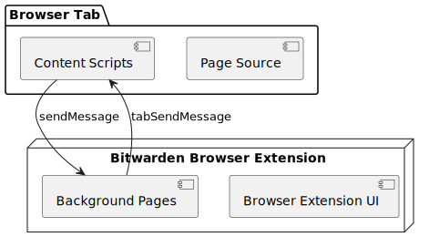

# 浏览器自动填充


对应的[官方页面地址](https://contributing.bitwarden.com/architecture/deep-dives/autofill/)


## 核心概念 

### 内容脚本 

[内容脚本](https://developer.mozilla.org/en-US/docs/Mozilla/Add-ons/WebExtensions/Content\_scripts)是浏览器在加载每个页面时插入到页面源代码中的脚本。内容脚本可以读取和修改所加载页面的内容，但它们无权访问全套浏览器 API。

Bitwarden 扩展使用内容脚本来执行自动填充功能，因为自动填充必须解析页面源以查找相关字段，并更改页面源以使用相关密码数据填充这些字段。

该扩展使用以下脚本进行自动填充：

| 内容脚本                         | 职责                               |
| ---------------------------- | -------------------------------- |
| `content/autofill.js`        | 从页面收集表单元素然后对相关字段执行自动填充操作。        |
| `content/autofiller.ts`      | 为启用了「启用页面加载时自动填充」设置的用户触发自动填充。    |
| `content/notificationBar.js` | 检测用户何时在网站上提交新的或更新的凭据，然后触发通知栏 UI。 |


Bitwarden 也使用了其他内容脚本，但这里的都是与自动填充功能相关的脚本。


### 背景页面和侦听器 

Bitwarden 浏览器扩展使用[后台页面](https://developer.chrome.com/docs/extensions/mv2/background\_pages/)来侦听和响应浏览器选项卡上运行的内容脚本触发的操作。它们通过使用 `BrowserApi.messageListener()` 附加到 `chrome.runtime.onMessage.addListener()` 来做到这一点。

Bitwarden 扩展中使用的后台脚本和侦听器是：

| 背景页面/监听器                     | 职责                                                                 |
| ---------------------------- | ------------------------------------------------------------------ |
| `runtime.background.ts`      | 处理与核心扩展功能相关的传入请求。                                                  |
| `notification.background.ts` | 处理与通知栏相关的传入请求。                                                     |
| `commands.background.ts`     | 处理与 Mv2 扩展键盘命令（包括自动填充）相关的传入请求。                                     |
| `onCommandListener.ts`       | 处理与 Mv3 扩展键盘命令（包括自动填充）相关的传入请求。                                     |
| `contextMenu.background.ts`  | 处理上下文菜单操作（包括自动填充）。                                                 |
| `main.background.js`         | 引导扩展。它在这里相关只是因为它（任意）包含了 `collectPageDetailsForContentScript()` 方法。 |

### 消息传递 

我们已经确定 Bitwarden 扩展使用内容脚本和后台页面或侦听器来执行自动填充。最后一个难题是他们之间的通信。自动填充架构利用[扩展消息传递 API](https://developer.mozilla.org/en-US/docs/Mozilla/Add-ons/WebExtensions/API/runtime/sendMessage) 在扩展 UI、后台页面和每个浏览器选项卡上运行的内容脚本之间进行通信。

<figure><figcaption></figcaption></figure>

#### 将请求从内容脚本发送到扩展 

要将请求从内容脚本发送到扩展，我们提供了两种服务：

* 当依赖注入可用时，应使用 `BrowserMessagingService` 及其提供的 `send()` 方法。
* 当没有可用的依赖注入时，应使用静态 `BrowserApi` 及其 `sendMessage()` 方法。

在扩展程序后台页面中，我们附加 `BrowserApi.messageListener` 来接收发送给扩展的消息。


`BrowserMessagingService` 和 `BrowserApi` 抽象了被浏览器公开的 `chrome.runtime.sendMessage` 和 `chrome.runtime.onMessage.addListener`。如果发现对此 API 的任何直接引用，应将其重构为使用我们的抽象程序之一。


#### 将请求从扩展发送到内容脚本 

我们使用 `BrowserApi.tabSendMessage` 将消息从扩展发送到浏览器选项卡上运行的内容脚本。

在选项卡上的内容脚本中，我们附加 `chrome.runtime.onMessage.addListener` 来接收发往该选项卡的消息。


`BrowserApi` 抽象了 `chrome.tabs.sendMessage` API。如果发现对此 API 的任何直接引用，应将其重构为使用我们的抽象程序之一。

