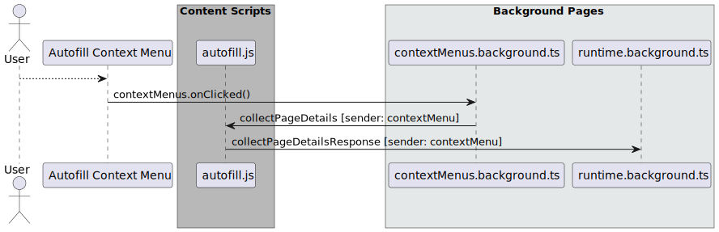

# 收集页面详细信息


对应的[官方页面地址](https://contributing.bitwarden.com/architecture/deep-dives/autofill/collecting-page-details)


自动填充流程的第一步是收集代码库中所谓的「页面详细信息」。页面详细信息是有关当前浏览器选项卡的页面源的元数据数组。

由于它需要访问选项卡的 DOM，因此页面详细信息的收集必须由内容脚本执行。Bitwarden 浏览器扩展通过 `autofill-init.ts` 内容脚本中初始化的 [`CollectAutofillContentService`](https://github.com/bitwarden/clients/blob/main/apps/browser/src/autofill/services/collect-autofill-content.service.ts) 方法执行此操作。此类中的逻辑负责解析页面 DOM 并返回表示当前选项卡的页面详细信息的数据结构。


**页面详情**

要深入了解页面详细信息中包含的内容，[`AutofillPageDetails`](https://github.com/bitwarden/clients/blob/master/apps/browser/src/autofill/models/autofill-page-details.ts) TypeScript 类的文档对属性及其用途进行了解释。


## 请求页面详细信息收集 

可以从其他内容脚本或扩展本身请求页面详细信息收集。

### 在后台请求页面详细信息 

在这两种情况下，内容脚本会请求页面详细信息收集：

* `notificationBar.js` 内容脚本检测到页面 DOM 或 URL 已更改，或者
* 用户打开了「页面加载时自动填充」，因此 `autofiller.ts` 会在页面加载时请求自动填充

在这两种情况下，页面详细信息收集的处理方式如下：

1. 请求内容脚本发送 `bgCollectPageDetails` 命令以将请求发送到 `runtime.background.ts` 后台页面。
2. `runtime.background.ts` 页面调用 `main.background.ts` 上的 `collectPageDetailsForContentScript` 方法。
3. `collectPageDetailsForContentScript` 方法将带有 `collectPageDetails` 命令的消息发送到 `autofill-init.ts` 内容脚本。
4. `autofill-init.ts` 内容脚本生成页面详细信息，然后广播一条发送方为 `autofiller` 或 `notificationBar` 的 `collectPageDetailsResponse` 消息。
5. `runtime.background.js` 和 `notification.background.js` 分别监听这两个消息，并对它们采取行动。

这些流程如下图所示：

#### 页面加载时自动填充 

<figure><figcaption></figcaption></figure>

#### 通知栏 

<figure><figcaption></figcaption></figure>

### 从上下文菜单请求页面详细信息 

Bitwarden 扩展用户可以通过右键单击页面然后选择「Bitwarden / 自动填充」，然后从与当前页面 URI 匹配的项目中选择一个密码库项目，从而从上下文菜单中触发自动填充。

当用户在上下文菜单中选择一个项目时，浏览器的 `contextMenu.OnClicked()` 事件就会被触发。该事件由 `contextMenus.background.js` 后台页面处理。该页面会发送一条发送方为 `contextMenus` 的 `collectPageDetails` 命令。`autofill-init.ts` 内容脚本捕获此请求，并在完成后发送一条发发送方为 `contextMenus` 的 `collectPageDetailsResponse` 消息，此消息由 `runtime.background.js` 后台页面处理。

<figure><figcaption></figcaption></figure>

### 通过键盘快捷键请求页面详细信息 

Bitwarden 自动填的键盘快捷键分别在 Manifest v2 和 v3 的 `manifest.json` 和 `manifest.v3.json` 文件中配置。该命令在清单文件中定义为 `autofill_login` 。当用户启动该组合键时，浏览器命令将广播给所有侦听器。此行为的详细介绍请参阅[此处](https://developer.mozilla.org/en-US/docs/Mozilla/Add-ons/WebExtensions/manifest.json/commands)。

#### **Manifest v2** 

在运行 Manifest v2 的浏览器扩展中，`commands.background.ts` 后台页面会侦听 `autofill_login` 命令。此后台页面在 `main.background.js` 上执行 `collectPageDetailsForContentScript()` 方法，该方法将 `collectPageDetails` 消息广播到 `autofill-init.ts` 内容脚本。

生成页面详细信息后，`autofill-init.ts` 内容脚本会广播一条发送方为 `autofill_cmd` 的 `collectPageDetailsResponse` 消息。`runtime.background.js` 后台页面会侦听并接收此消息。

<figure><figcaption></figcaption></figure>

#### **Manifest v3** 

对于运行 Manifest v3 的浏览器扩展，后台页面将替换为 `commandListener`。`commandListener` 会侦听 `autofill_login` 命令，并通过广播 `collectPageDetailsImmediately` 命令进行响应。

`collectPageDetailsImmediately` 与 `collectPageDetails` 命令不同，因为响应**不是**通过浏览器命令 API 广播的另一条消息。相反，`autofill-init.ts` 内容脚本执行页面详细信息生成然后通过 Promise 异步返回响应。

<figure><figcaption></figcaption></figure>

### 从扩展 UI 请求页面详细信息 

用户可以通过两种方式从 Bitwarden 浏览器扩展 UI 请求自动填充：

* 在查看密码库中的项目时点击「自动填充」按钮 ( `view.component.ts` )，或者
* 在当前标签视图中点击密码库项目 ( `current-tab.component.ts` )

在这两种情况下，组件都会将扩展实例的唯一 `BroadcasterSubscriptionId` 作为 `sender` 发送 `collectPageDetails` 命令。`autofill-init.ts` 内容脚本会生成页面详细信息，然后使用相同的 `sender` 响应 `collectPageDetailsResponse` 消息，确保消息被正确的发送方接收。

<figure><figcaption></figcaption></figure>

## 执行页面详细信息收集 

在上述所有场景中，`autofill-init.ts` 内容脚本都会收到收集页面详细信息的请求。此时，将通过 `CollectAutofillContentService` 中的 `getPageDetails()` 方法收集页面详细信息。

`getPageDetails()` 方法解析页面 DOM 并创建 [`AutofillPageDetails`](https://github.com/bitwarden/clients/blob/master/apps/browser/src/autofill/models/autofill-page-details.ts) 类的实例。

该类包含 [`AutofillField`](https://github.com/bitwarden/clients/blob/master/apps/browser/src/autofill/models/autofill-field.ts) 和 [`AutofillForm`](https://github.com/bitwarden/clients/blob/master/apps/browser/src/autofill/models/autofill-form.ts) 对象的数组，每个对象代表页面源上一个潜在可填充字段。对象的属性将在自动填充流程的下一步「[生成填充脚本](generating-fill-scripts.md#generating-the-fill-script)」中使用。
