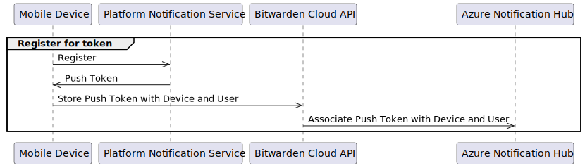
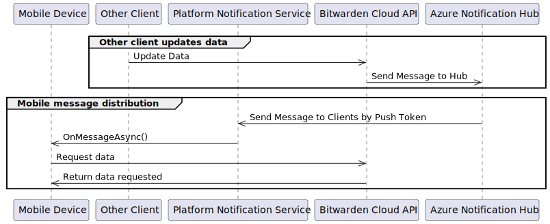

# =移动端推送通知


对应的官方页面地址


## 概述 

推送通知是一个有些复杂的领域，它们的实现在服务器和客户端上都根据不同的维度而有所不同。

从服务器角度来看，Bitwarden 云托管实例和自托管实例的实现有所不同。主要区别在于自托管客户端需要通过 Bitwarden 云托管实例中继其消息。这是必需的，因为只允许 Bitwarden 向商店分发的 Android 和 iOS 移动应用程序发送通知。.

从客户端的角度来看，移动操作系统（Android 和 iOS）之间的实现有所不同。这是因为每个操作系统以不同的方式处理获取和刷新推送令牌。

我们将首先查看服务器端实现，然后查看在客户端获取推送令牌。

## 服务器实施 

### 发送推送令牌到 Azure 通知中心 

移动客户端（无论是 iOS 还是 Android）都会收到一个不透明令牌，该令牌向特定于平台的通知服务代表该物理设备。客户端通过向 Bitwarden API 上的 `/devices/identifier/{deviceIdentifier}/token` 端点发出 `POST` 请求，将此令牌传输到服务器。在移动客户端上，这是在 [`PushNotificationListenerService`](https://github.com/bitwarden/mobile/blob/master/src/App/Services/PushNotificationListenerService.cs) 的 `OnRegisteredAsync()` 方法中完成的。

然后，Bitwarden API 负责将此令牌提交到 Azure 通知中心。在服务器上，不透明推送令牌通过请求中的 `access_token` 中显示的用户和 URL 路径中的物理设备与特定用户关联。这存储在 SQL 中的 `Device` 表中。


重要的是要认识到，此时我们已将令牌与用户**和**物理设备的组合相关联，因为这**两者**都用作 Azure 通知中心中注册的标记。这就是我们如何确保仅当适当的用户在另一台设备上触发后续通知时，才会将后续通知发送到设备。


#### 云端实施 

<figure><figcaption></figcaption></figure>

如果我们运行 Bitwarden 云实例，Bitwarden API 负责直接与 Azure 通知中心通信以注册推送令牌。这是在 [`NotificationHubPushRegistrationService`](https://github.com/bitwarden/server/blob/master/src/Core/Services/Implementations/NotificationHubPushRegistrationService.cs) 上的 `CreateOrUpdateRegistrationAsync()` 方法中完成的。

#### 自托管实施 

<figure><figcaption></figcaption></figure>

对于自托管实例，自托管实例无法直接与 Bitwarden 的 Azure 通知中心通信。为了向自托管实例提供推送通知，自托管 Bitwarden API 必须通过 [`RelayPushRegistrationService`](https://github.com/bitwarden/server/blob/master/src/Core/Services/Implementations/RelayPushRegistrationService.cs) 上的 `CreateOrUpdateRegistrationAsync()` 方法向 Azure 通知中心注册。

此 [`IPushRegistrationService`](https://github.com/bitwarden/server/blob/master/src/Core/Services/IPushRegistrationService.cs) 的实现允许自托管 Bitwarden API 通过调用 Bitwarden Cloud API 中 [`PushController`](https://github.com/bitwarden/server/blob/master/src/Api/Controllers/PushController.cs) 上的 `/push/register` 端点来注册推送令牌。这以 [https://push.bitwarden.com](https://push.bitwarden.com/) 的形式向自托管实例公开。然后，Bitwarden Cloud API 上的 [`PushController`](https://github.com/bitwarden/server/blob/master/src/Api/Controllers/PushController.cs) 会像云注册一样注册推送令牌 - 将其发送到 Azure 通知中心。


在通过中继推送通知服务时，了解上下文的变化非常重要。中继在运行 Bitwarden API 的两个不同服务器（自托管实例和 Bitwarden 云实例）之间进行通信。这些服务器中的每一个都有不同的 IPushNotificationService 实现。一旦 Bitwarden Cloud API `/push/register` 端点收到消息，就会像服务本身触发的任何其他推送通知一样对其进行处理。


### 使用推送令牌发送通知到设备 

当客户端更改数据或发送无密码身份验证请求时，服务器负责向所有移动客户端发送推送通知，以使它们了解更改。

#### 云端实施 

<figure><figcaption></figcaption></figure>

对于移动设备的通知，这是在 [`NotificationHubPushNotificationService`](https://github.com/bitwarden/server/blob/master/src/Core/Services/Implementations/NotificationHubPushNotificationService.cs) 中处理的。此服务使用 `Microsoft.Azure.NotificationHubs` SDK 将通知发送到 Azure 通知中心。

向 Azure 通知中心注册时，每个推送令牌都与用户和设备相关联，如我们上面所见。此时，这些标签用于定位特定通知。对于服务器希望发送的每种类型的通知，都标有设备标识符和用户 ID。然后，Azure 通知中心使用这些标记来查找推送令牌并将通知发送到正确的设备。这可确保我们仅在用户和设备匹配时才向设备发送通知。

#### 自托管实施 

<figure><figcaption></figcaption></figure>

与注册推送令牌一样，自托管实例使用 Bitwarden Cloud API 上的 [`PushController`](https://github.com/bitwarden/server/blob/master/src/Api/Controllers/PushController.cs) 作为代理与 Azure 通知中心进行通信。

自托管 Bitwarden API 调用 Bitwarden Cloud API 上 `PushController` 上的 `/send` 端点，将推送负载传输到 Bitwarden Cloud API。然后，云 API 使用与云生成的消息相同的 [`NotificationHubPushNotificationService`](https://github.com/bitwarden/server/blob/master/src/Core/Services/Implementations/NotificationHubPushNotificationService.cs) 将数据传输到 Azure 通知中心。

值得注意的是，从 Cloud API 的角度来看，它处理从 `/send` 端点接收的消息的方式与处理 Bitwarden 云服务器上的操作生成的消息的方式相同；没有区别，并且无论哪种方式都会执行相同的代码。

推送通知有效负载中不会发送任何解密数据，并且在由推送中继代理时，数据绝不会存储在 Bitwarden Cloud 数据库中。这使得我们的自托管实例能够将其数据与 Bitwarden 云隔离，并且仍然使用推送通知。

## 客户端注册 

### 在移动客户端获取推送令牌 

移动客户端上获取不透明设备推送令牌的过程因移动操作系统而异。

#### **Android** 

Android 推送令牌由 [`FirebaseMessagingService`](https://github.com/bitwarden/mobile/blob/master/src/Android/Push/FirebaseMessagingService.cs) 接收。Firebase Cloud Messaging (FCM) 是用于向 Android 设备推送通知的平台通知服务。当Android操作系统最初获取应用程序的令牌或更新令牌时，会触发此服务中的 `OnNewToken()` 方法。

在 `OnNewToken()` 方法中，我们更新设备状态中的 `PushRegisteredToken` 并触发 [`AndroidPushNotificationService`](https://github.com/bitwarden/mobile/blob/master/src/Android/Services/AndroidPushNotificationService.cs) 的 `RegisterAsync()` 方法。

在这里，我们在 state 中使用 `PushRegisteredToken` 来表示最近从 FCM 收到的令牌。它的范围对于给定设备只存在一次，因为 FCM 会将推送令牌分配给给定设备，而不管设备上的 Bitwarden 帐户如何。

此时，`PushRegisteredToken` 代表FCM分配给设备的令牌。但是，Bitwarden 会在设备上存储每个用户的推送令牌，以便适当地定位通知。为了捕获这种粒度级别，我们将 `PushCurrentToken` 存储在用户级别的状态中。 `PushCurrentToken` 代表单个用户的推送令牌，该令牌可能会或可能不会与 FCM 分配的令牌过期。

[`AndroidPushNotificationService`](https://github.com/bitwarden/mobile/blob/master/src/Android/Services/AndroidPushNotificationService.cs) 上的 `RegisterSync()` 负责确定分配给设备的 `PushRegisteredToken` 是否与分配给当前设备的 `PushCurrentToken` 不同。用户。

如果分配给设备的当前令牌与用户的令牌不同，我们会在 `PushNotificationListenerService` 上调用 `OnRegisteredSync()` 来：

* 通过 Bitwarden API 为活动用户注册新的 `PushRegisteredToken`
* 将 `PushCurrentToken` 设置为活动用户的新值

正如我们所看到的，`RegisterSync()` 仅为活动用户处理注册推送令牌。在设备上有多个用户的情况下，只有当 FCM 发出新令牌时处于活动状态的用户才会通过迄今为止描述的过程获得更新。

对于设备上的其他用户，当他们下次登录应用程序或应用程序切换到他们的帐户时，将启动 `RegisterSync()`。这是在 [`GroupingsPage`](https://github.com/bitwarden/mobile/blob/master/src/App/Pages/Vault/GroupingsPage/GroupingsPage.xaml.cs) 的初始化中完成的。对此用户进行了相同的比较，在这种情况下，`PushRegisteredToken` 仍然与该用户的 `PushCurrentToken` 不同（因为我们只更新了 `PushCurrentToken` 对于迄今为止的初始用户）。此时，Bitwarden API 会收到通知，后续用户已注册新令牌。


Android 推送通知文档适用于从 Google Play 商店安装的 Bitwarden 应用程序。 FDroid 版本不支持推送通知。这些构建使用 [`NoopPushNotificationListenerService`](https://github.com/bitwarden/mobile/blob/master/src/App/Services/NoopPushNotificationListenerService.cs) 和 [`NoopPushNotificationService`](https://github.com/bitwarden/mobile/blob/master/src/App/Services/NoopPushNotificationService.cs)。


#### **iOS** 

在 iOS 设备上，推送令牌注册是通过 Apple 推送通知服务 (APN) 进行的。

当用户登录 iOS 应用程序或切换帐户时，应用程序会加载 [`GroupingsPage`](https://github.com/bitwarden/mobile/blob/master/src/App/Pages/Vault/GroupingsPage/GroupingsPage.xaml.cs) 。在 [`GroupingsPage`](https://github.com/bitwarden/mobile/blob/master/src/App/Pages/Vault/GroupingsPage/GroupingsPage.xaml.cs) 初始化中，我们首先检查以确保设备已接受推送通知。如果没有，则会显示 Bitwarden 推送通知提示。此提示解释了为什么 iOS 将请求 Bitwarden 移动应用程序的推送通知。

如果用户接受此提示，或者他们已经接受了该提示，则应用程序会检查当前用户是否在最后一天内注册了推送通知。如果他们之前从未注册过，或者已经过去一天以上，Bitwarden 应用程序会向 iOS 注册推送通知，并请求推送令牌。这是在 [`iOSPushNotificationService`](https://github.com/bitwarden/mobile/blob/master/src/iOS/Services/iOSPushNotificationService.cs) 中的 `RegisterAsync()` 方法中完成的。`RegisterAsync()` 执行从 APN 开始令牌请求过程所需的 iOS 平台特定方法。

异步接收带有推送令牌的 APN 响应。当设备获得令牌时，会触发 [`iOSPushNotificationHandler`](https://github.com/bitwarden/mobile/blob/master/src/iOS/Services/iOSPushNotificationHandler.cs) 中的 `OnRegisteredSuccess()` 方法。然后调用 `P`[`ushNotificationListenerService`](https://github.com/bitwarden/mobile/blob/master/src/App/Services/PushNotificationListenerService.cs) 的 `OnRegisteredAsync()` 方法，传递新获取的令牌。此方法负责将推送令牌发送到后端 API，以注册推送通知的设备+用户组合。


我们每天为设备上的每个帐户注册一次推送令牌。然而，从 iOS 收到的令牌很可能每天都是相同的。在某些特定场景中，例如从备份恢复设备，会为设备生成不同的令牌。尽管通常情况并非如此，但我们每天都会检查以确保 Bitwarden Azure 通知中心是最新的。


