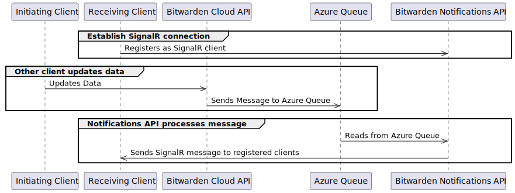
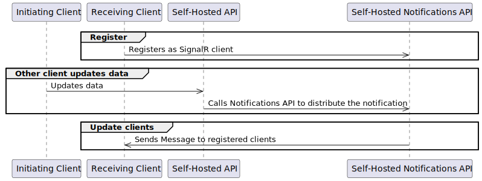

# 其他客户端推送通知


对应的[官方页面地址](https://contributing.bitwarden.com/architecture/deep-dives/push-notifications/non-mobile)


对于非移动客户端，推送通知由 [SignalR](https://learn.microsoft.com/en-us/aspnet/core/signalr/introduction) 处理，SignalR 是微软使用 WebSockets 进行实时客户端通信的库。

## 服务器实现 

当必须向已注册的非移动客户端发送实时变更时，Bitwarden API 负责为其配置的服务器实例分发信息。服务器使用 [`IPushNotificationService`](https://github.com/bitwarden/server/blob/master/src/Core/Services/IPushNotificationService.cs) 接口对此进行抽象，该接口根据实例是云托管还是自托管而有不同的实现方式。

### 云端实现 

<figure><figcaption></figcaption></figure>

对于 Bitwarden Cloud 实现，API 使用 [`AzureQueuePushNotificationService`](https://github.com/bitwarden/server/blob/master/src/Core/Services/Implementations/AzureQueuePushNotificationService.cs) 实现。该服务将推送通知提交到 Bitwarden Azure 租户中的 Azure 队列。

Bitwarden 云通知 API 包含一个队列处理器 ([`AzureQueueHostedService`](https://github.com/bitwarden/server/blob/master/src/Notifications/AzureQueueHostedService.cs)) 用于监视 Azure 队列中待处理的推送通知。处理器从队列中提取消息，然后将它们发送给发起用户或组织注册的所有客户端。

### 自托管实现 

<figure><figcaption></figcaption></figure>

对于自托管实现，推送通知架构有所不同，因为没有可用的 Azure 队列。

自托管实例的流程略有简化，因为它们无法访问 Azure 资源（例如 Azure 队列）。总体流程仍然与云托管实现相同，不同之处在于自托管 Bitwarden API 不使用 Azure 队列缓冲通知，而是将通知直接提交到自托管通知 API。

## 客户端注册 

当非移动客户端启动并且用户通过身份验证时，它会为其已配置的服务器实例初始化一个连接到通知服务 ( `/notifications/hub` ) 的 WebSocket 连接。该请求包含它们的 JWT `bearer` 令牌，该令牌用于检索用户 ID，进而确定用户接收哪些通知。
