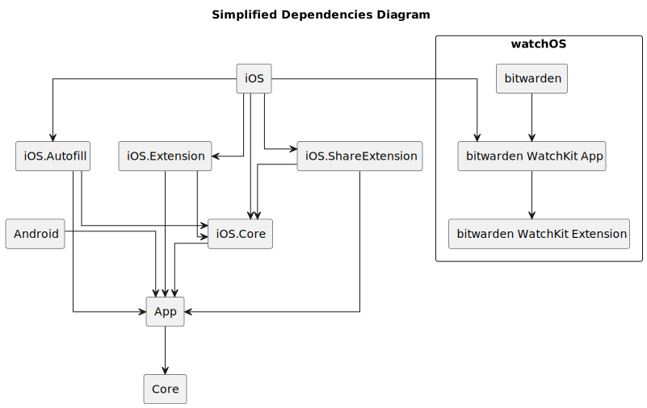

# =.NET MAUI (legacy)


对应的[官方页面地址](https://contributing.bitwarden.com/architecture/mobile-clients/net-maui-legacy/)


移动 .NET MAUI 客户端是具有扩展的 Android、iOS 应用程序以及 watchOS。它们都位于 [https://github.com/bitwarden/mobile](https://github.com/bitwarden/mobile)。

主要结构如下：

* `Core`：侧重于 App 逻辑部分的共享代码。有几个类是从 Web 客户端移植到 C# 的。
* `App`：共享代码，侧重于应用程序的表示层和一些业务逻辑。
* `Android`：特定于 Android 平台的所有代码
* `iOS`：特定于 iOS 平台的所有代码
* `iOS.Core`：iOS App 及其扩展使用的共享代码
* `iOS.Autofill`：处理自动填充的 iOS 扩展
* `iOS.Extensions`：从底层表扩展处理自动填充的 iOS 扩展
* `iOS.ShareExtension`：通过 Send 处理共享文件的 iOS 扩展
* `watchOS`：特定于 watchOS 平台的所有代码
  * `bitwarden`：存根 iOS App ，以便 watchOS App 在 XCode 上有一个配套 App
  * `bitwarden WatchKit App`：主 Watch App ，我们在其中设置资产。
  * `bitwarden WatchKit Extension`：Watch App 的所有逻辑和表示层逻辑都在这里

## 依赖关系图 

下面是移动存储库的简化依赖关系图。

<figure><figcaption></figcaption></figure>

