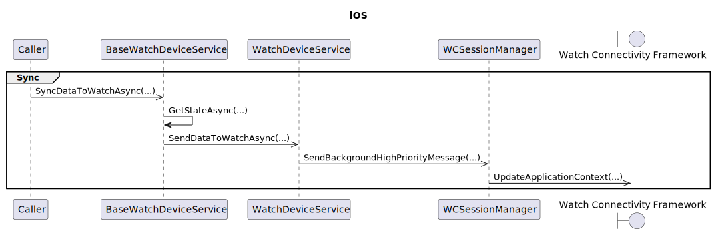
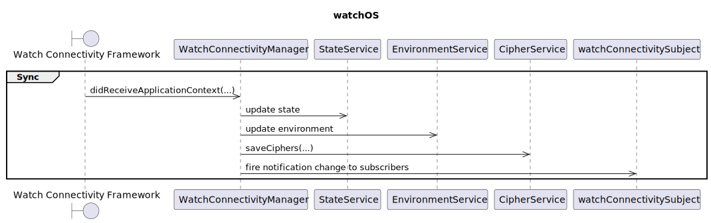

# watchOS


对应的[官方页面地址](https://contributing.bitwarden.com/architecture/mobile-clients/watchOS)


## 整体架构 <a href="#overall-architecture" id="overall-architecture"></a>

watchOS 应用程序的结构如下：

* `src/watchOS` ：特定于 watchOS 平台的所有代码
  * `bitwarden` ：存根 iOS 应用程序，以便 watchOS 应用程序在 XCode 上有一个配套应用程序
  * `bitwarden WatchKit App` ：我们设置资产的主 Watch 应用程序
  * `bitwarden WatchKit Extension` ：Watch 应用程序的所有逻辑和表示逻辑都在这里

因此，几乎所有与 Watch 应用程序相关的内容都将放在 **WatchKit 扩展**中，而 WatchKit 应用中将只包含资产和一些配置。

然后，在扩展中，我们有一个分层架构：

* 状态（这是 iOS 状态的一个非常简化的版本）
* 持久化（这里我们使用 `CoreData` 与数据库交互）
* 服务（顶级生成、加密服务和业务逻辑）
* 表示（对于具有 MVVM 模式的 UI 使用 `SwiftUI` ）

## 与 iOS 集成 <a href="#integration-with-ios" id="integration-with-ios"></a>

watchOS 应用程序是使用 `XCode` 和 `Swift` 开发的，我们需要将其集成到 `Xamarin` iOS 应用程序中。

为此，我们采用了 `Xamarin.Forms` GitHub 代码库中提供的[解决方案](https://github.com/xamarin/xamarin-macios/issues/10070#issuecomment-1033428823)，并根据我们的需要对 `iOS.csproj` 进行了修改：

```xml
<PropertyGroup>
    <WatchAppBuildPath Condition=" '$(Configuration)' == 'Debug' ">$(Home)/Library/Developer/Xcode/DerivedData/bitwarden-cbtqsueryycvflfzbsoteofskiyr/Build/Products</WatchAppBuildPath>
    <WatchAppBuildPath Condition=" '$(Configuration)' != 'Debug' ">$([System.IO.Path]::GetFullPath('$(MSBuildProjectDirectory)\..'))/watchOS/bitwarden.xcarchive/Products/Applications/bitwarden.app/Watch</WatchAppBuildPath>
    <WatchAppBundle>Bitwarden.app</WatchAppBundle>
    <WatchAppConfiguration Condition=" '$(Platform)' == 'iPhoneSimulator' ">watchsimulator</WatchAppConfiguration>
    <WatchAppConfiguration Condition=" '$(Platform)' == 'iPhone' ">watchos</WatchAppConfiguration>
    <WatchAppBundleFullPath Condition=" '$(Configuration)' == 'Debug' ">$(WatchAppBuildPath)/$(Configuration)-$(WatchAppConfiguration)/$(WatchAppBundle)</WatchAppBundleFullPath>
    <WatchAppBundleFullPath Condition=" '$(Configuration)' != 'Debug' ">$(WatchAppBuildPath)/$(WatchAppBundle)</WatchAppBundleFullPath>
</PropertyGroup>

...

<ItemGroup Condition=" '$(Configuration)' == 'Debug' AND Exists('$(WatchAppBundleFullPath)') ">
    <_ResolvedWatchAppReferences Include="$(WatchAppBundleFullPath)" />
</ItemGroup>
<ItemGroup Condition=" '$(Configuration)' != 'Debug' ">
    <_ResolvedWatchAppReferences Include="$(WatchAppBundleFullPath)" />
</ItemGroup>
<PropertyGroup Condition=" '$(_ResolvedWatchAppReferences)' != '' ">
    <CodesignExtraArgs>--deep</CodesignExtraArgs>
</PropertyGroup>
<Target Name="PrintWatchAppBundleStatus" BeforeTargets="Build">
    <Message Text="WatchAppBundleFullPath: '$(WatchAppBundleFullPath)' exists" Condition=" Exists('$(WatchAppBundleFullPath)') " />
    <Message Text="WatchAppBundleFullPath: '$(WatchAppBundleFullPath)' does NOT exist" Condition=" !Exists('$(WatchAppBundleFullPath)') " />
</Target>
```

因此，在 `PropertyGroup` 上， `WatchAppBundleFullPath` 会根据配置和平台以及 XCode watchOS 应用程序构建的输出结果组装在一起。然后，根据 Watch 应用程序是否存在和配置情况，在一些 `ItemGroup` 中加入 Watch 应用程序。任务 `_ResolvedWatchAppReferences` 负责查看由 XCode 构建的 `Bitwarden.app` ，如果它找到 Watch 应用程序，就会将其捆绑到 Xamarin iOS 应用程序。最后，如果 Watch 应用程序已捆绑，则会启用深度签名并打印构建路径。


正如我们在 csproj 中看到的那样，要将 watchOS 应用程序捆绑到 iOS 应用程序中，我们需要以正确的平台为目标。因此，如果要使用设备，可在 XCode 上以设备为目标构建 watchOS 应用程序，构建完成后可转到 VS4M 构建 iOS 应用程序（该程序将捆绑 watchOS 应用程序）并在设备上运行。


## 同步 iPhone <-> 手表 <a href="#synchronization-iphone-watch" id="synchronization-iphone-watch"></a>

为了在 iPhone 和 Watch 应用程序之间同步数据，需要使用 [Watch Connectivity Framework](https://developer.apple.com/documentation/watchconnectivity)。

因此，每一边都有一个 Watch Connectivity Manager，它是每个平台上的服务进行通信而使用的接口。

在同步通信中，主要使用 [updateApplicationContext](https://developer.apple.com/documentation/watchconnectivity/wcsession/1615621-updateapplicationcontext)，因为它总能提供最新发送的数据，而且是在后台发送，对方设备不一定需要在范围内（因此会缓存直到可以发送为止）。此外，[sendMessage](https://developer.apple.com/documentation/watchconnectivity/wcsession/1615687-sendmessage) 还用于向对方发出要快速执行某些操作的信号（例如从 Watch 触发同步）。

`WatchDTO` 是在同步中发送的对象，其中包含 Watch 的所有信息。

<div align="left">

<figure><figcaption></figcaption></figure>

</div>

<div align="left">

<figure><figcaption></figcaption></figure>

</div>

## 状态 <a href="#states" id="states"></a>

接下来是 Watch 应用程序在给定时间内可能处于的状态：

* **有效**： 一切正常，用户可以通过 TOTP 查看密码库密码
* **需要登录**： 用户需要使用 iPhone 登录
* **需要设置**： 用户需要在他们的 iPhone 上设置一个启用了「连接到 Watch」功能的账户
* **需要高级会员**： 当前账户不是高级会员
* **需要 2FA 项目**： 当前账户没有设置任何 TOTP 密码
* **同步**： 在更换账户以及同步新的密码库 TOTP 时显示
* **需要设备所有者验证**：用户需要设置 Apple Watch 通行代码才能使用此应用程序

## 持久化和加密 <a href="#persistence-and-encryption" id="persistence-and-encryption"></a>

在 Watch 上，[CoreData](https://developer.apple.com/documentation/coredata) 用作密码的持久化。因此，为了加密其中的数据，在每个加密属性中都使用了一个值转换器：`StringEncryptionTransformer`。

在转换器中，将调用 `CryptoService`，最终使用 [AES.GCM](https://developer.apple.com/documentation/cryptokit/aes/gcm) 和 256 位 [SymmetricKey](https://developer.apple.com/documentation/cryptokit/symmetrickey) 对数据进行加密。密钥会在第一次加密时生成/加载，并存储在设备钥匙串中。

## 崩溃报告 <a href="#crash-reporting" id="crash-reporting"></a>

在所有其他移动应用程序中，[AppCenter](https://appcenter.ms/) 被用作崩溃报告工具。但是，它不支持 watchOS（也不支持用于处理崩溃的内部库）。

因此，在 watchOS 应用程序上使用 [Firebase Crashlytics](https://firebase.google.com/docs/crashlytics)，并启用了基本的崩溃报告功能（这里还没有处理错误日志记录）。为此，需要在 CI 中注入 `GoogleService-Info.plist` 文件。

在撰写本文档时，尚未为开发环境配置 plist，因此在**非 DEBUG** 配置中启用 `Crashlytics`。

有一个 `Log` 类用于记录应用程序中发生的错误，但它仅在 **DEBUG** 配置中启用。
