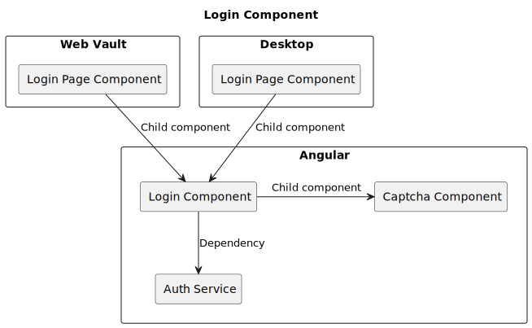
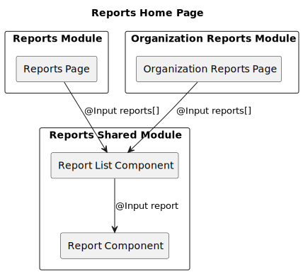

# Angular


对应的[官方页面地址](https://contributing.bitwarden.com/architecture/clients/presentation/angular)


对于 Bitwarden，我们使用 Angular 作为我们的客户端框架。在继续阅读之前建议对 Angular 有一个基本的了解，如果不确定请参考官方 [Angular 文档](https://angular.io/docs)或 [Angular 入门](https://angular.io/start)。我们也尽力遵循 [Angular 风格指南](https://angular.io/guide/styleguide)。

本文档旨在涵盖我们所遵循的最佳实践。它们中的大部分最初是基于不同的 ADR，虽然尽管 ADR 擅长描述原因，但它们提供了次优的阅读体验。

## 命名 ([ADR-0012](../adr/0012-angular-filename-convention.md)) <a href="#naming-adr-0012" id="naming-adr-0012"></a>

我们遵循 Angular 风格指南中的[命名](https://angular.io/guide/styleguide#naming)部分。更具体地说，使用破折号来分隔描述性名称中的单词，并使用点来分隔名称和类型。

我们使用以下由 [Style-02-01](https://angular.io/guide/styleguide#general-naming-guidelines) 建议的常规后缀：

* `service` - 服务（在 Bitwarden，此类型表示抽象服务）
* `component` - Angular 组件
* `pipe` - Angular 管道
* `module` - Angular 模块
* `directive` - Angular 指令

在 Bitwarden，我们还使用了更多的类型：

* `.api` - API 模型
* `.data` - 数据模型（用于序列化域模型）
* `.view` - 视图模型（解密域模型）
* `.export` - 导出模型
* `.request` - API 请求
* `.response` - API 响应
* `.type` - 枚举
* `.service.implementation` - 抽象服务的实现

类名也应使用后缀作为其类名的一部分。例如，服务实现被命名为 `FolderServiceImplementation`，请求模型被命名为 `FolderRequest`。

摘要比实现更频繁地被引用，摘要使用简化类型，而实现必须指定它们是实现，例如，`.service` 用于摘要，`.service.implementation` 用于植入。

## 按功能组织 ([ADR-0011](https://contributing.bitwarden.com/architecture/adr/angular-folder-structure)) <a href="#organize-by-feature-adr-0011" id="organize-by-feature-adr-0011"></a>

我们努力遵循 Angular 风格指南中的[应用程序结构和 NgModules](https://angular.io/guide/styleguide#application-structure-and-ngmodules) 部分。

文件夹结构应按功能以分层方式组织。功能又由团队拥有。下面是一个简化的文件夹结构，可能与当前结构有所不同。

在示例中，我们有一个团队 `auth` ，它具有单一的紧急访问功能。紧急访问功能由服务、一些组件和一个管道组成。该功能进一步细分为 `view` 功能，用于处理查看其他用户的密码库。

`core` 和 `shared` 目录不属于某一个团队，但而归平台团队所有。`core` 和 `shared` 模块是 Angular 中的标准概念，`core` 包含了在整个应用程序中使用的单例服务，`shared` 包含了大量重复使用的组件。

```
apps/web/src/app/
├─ core/                         // Core services vital to the web app
|  ├─ services/
|  |  ├─ web-platform-utils.service.ts
│  ├─ shared.module.ts
│  ├─ index.ts
├─ shared/                       // Shared functionality usually owned by platform
│  ├─ feature/                   // Feature module
│  ├─ shared.module.ts
│  ├─ index.ts
├─ auth/                         // Auth team
│  ├─ shared/                    // Generic components shared across the team
│  ├─ emergency-access/          // Feature module
│  │  ├─ access-type.pipe.ts
│  │  ├─ ea.module.ts
│  │  ├─ ea-routing.module.ts
│  │  ├─ ea.service.ts           // Service encapsulating all business logic
│  │  ├─ ea.component.{ts,html)
│  │  ├─ dialogs/                // Dialogs used by the root component.
│  │  ├─ view/                   // Logical group of components for viewing ea vault
│  │  ├─ index.ts
│  ├─ index.ts                   // Public interface that can be used by other teams
├─  app.component.ts
├─ app.module.ts
```

## 可观察对象 ([ADR-0003](../adr/0003-adopt-observable-data-services-for-angular.md)) <a href="#observables-adr-0003" id="observables-adr-0003"></a>

我们目前正处于使用 [RxJS](https://angular.io/guide/rx-library) 向响应式数据层迁移的过程中。这主要是指组件订阅状态服务，如 `FolderService`，并在数据发生变化时持续获得更新。这可以确保组件始终保持最新。

之前，我们手动实现了一个事件系统，用于发送基本消息，告诉其他组件重新加载它们状态。这很容易出错，并且难以维护。

```
// Example component which displays a list of folders
@Component({
  selector: "app-folders-list",
  template: `
    <ul>
      <li *ngFor="let folder of folders$ | async">
        {{ folder.name }}
      </li>
    </ul>
  `,
})
export class FoldersListComponent {
  folders$: Observable<FolderView[]>;

  constructor(private folderService: FolderService) {}

  ngOnInit() {
    this.folders$ = this.folderService.folderViews$;
  }
}
```

## 响应式表单 ([ADR-0001](../adr/reactive-forms.md)) <a href="#reactive-forms-adr-0001" id="reactive-forms-adr-0001"></a>

我们几乎只使用 [Angular Reactive 表单](https://angular.io/guide/reactive-forms)，而不是模板驱动表单。Bitwarden 组件库就是为了与响应式表单集成而设计的。

> 提供对底层表单的对象模型的直接、显式访问。与模板驱动的表单相比，它们更加强大：更具可扩展性、可重用性和可测试性。如果表单是您的应用程序的关键部分，或者您已经在使用响应式模式构建应用程序，请使用响应式表单。
>
> _https://angular.io/guide/forms-overview#choosing-an-approach_

## 轻量化组件 <a href="#thin-components" id="thin-components"></a>

组件应该很薄，只包含渲染视图所需的逻辑。所有其他逻辑都属于服务。这样，行为几乎相同但视觉上看起来截然不同的组件就可以通过共享相同的服务来避免代码重复。服务往往也比组件更容易测试。

### 组合优于继承 ([ADR-0009](../adr/0009-composition-over-inheritance.md)) <a href="#composition-over-inheritance-adr-0009" id="composition-over-inheritance-adr-0009"></a>

由于 Bitwarden 的多客户端特性，我们有很多共享组件，这些组件的行为在客户端之间略有不同。传统上，这是使用继承来实现的，但是随着应用程序的不断发展，这导致了难以使用的大型组件以及多级继承树。

为了避免这种情况，组件应该被分解成逻辑上独立的部分。不同的客户端应该通过自定义页面级组件来使用共享组件。

<div align="left">

<figure><figcaption></figcaption></figure>

</div>

可以理解的是，当不同的客户端使用不同的 CSS 框架时，要正确实现这一点是很困难的，在所有内容都正确迁移到 Bootstrap 之前，这意味着每个客户端都将有一个扩展通用登录组件的登录组件。不过，它应该只暴露特定于客户端的模板。

下图展示了报告如何通过将列表提取到共享组件中来共享逻辑。而不是组织组件直接扩展基本报告页面组件。有关更多详细信息，请参阅读[重构的 PR](https://github.com/bitwarden/clients/pull/3204)。

<div align="left">

<figure><figcaption></figcaption></figure>

</div>
